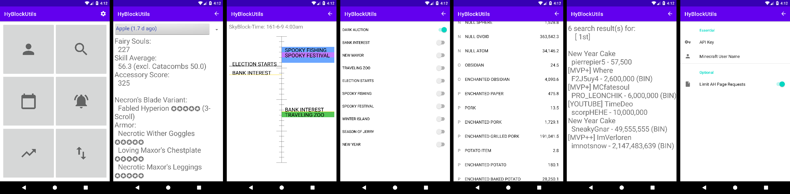

# HyBlockUtils: An Android App for Hypixel SkyBlock
An Android app containing a collection of useful tools for Hypixel SkyBlock

## Pages
- **Main Menu**
- **Profile Viewer**  - personal and search
- **Calender**        - showing upcoming events in the next 48 hours in two columns
- **Notifications**   - for next Dark Auction and other important events like Spooky Festival, etc.
- **Bazaar**          - list of all items and prices sorted by category name
- **AH Price Lookup** - search through all ah items names and lore using space separated keywords; double quotes for grouping
- **Settings**        - API key, personal user name and an option to limit the ah page requests to 10 instead of the full 70

## First Steps
1. **API Key**            - look up your hypixel api key or enter `/api` in-game to create a new one
    - in case your android device gets stolen or you've entered the key on a rooted device (on which the internal storage is insecure to use) I recommend generating a new api key to render your old one invalid
3. **API Settings**       - go to the gear icon in the top right corner and enter your API key
4. **User Name Setting**  - go to the gear icon in the top right corner and enter your or any other user name (used for the personal Profile Viewer)
5. Done

## Requirements
- Most versions of Android will work (API level 16 and higher)
    - tested with API level 16-emulated (Jelly Bean 4.1), 17-emulated (Jelly Bean 4.2), 22-emulated (Lollipop 5.1), 23-physical (Marshmallow 6.0), 25-emulated (Nougat 7.1) and 30-physical (Android 11)
- Internet connection
    - the faster the better (more speed = less waiting for all the api requests)
    - **preferably use W-Lan for the fully enabled ah feature** (70 ah pages are about 120 MB of data volume)
- About 150 MB of RAM
    - maximum usage for an empty ah query -> all ah items in memory (about 70,000 items)
- About 10 MB of internal memory (ROM)
- Touch screen
    - tested with 320x480, 480x800, 720x1280 and 1080x1920
    - the bigger the more you see and the less you need to scroll
- CPU
    - tested with octa-core 1.3 GHz prozessor (among others)
    - again - the faster the better (more speed = less waiting for data preperation and screen updates)

## Credits
- TheNullicorn - for this amazing NBT parsing lib https://github.com/TheNullicorn/Nedit
